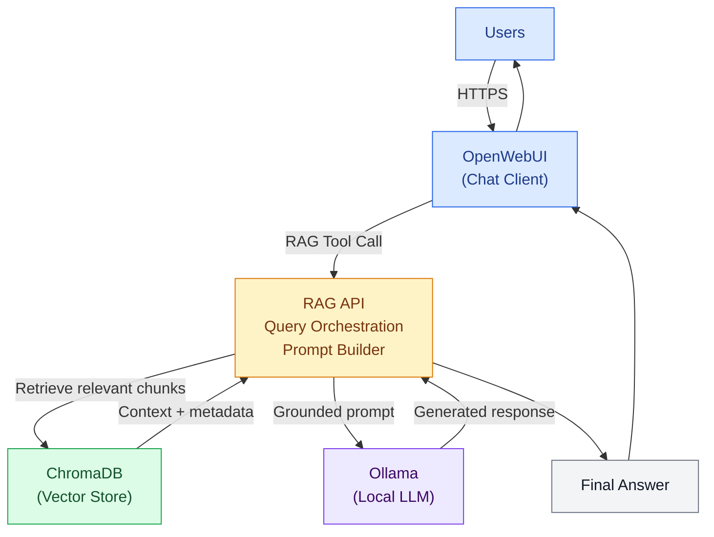
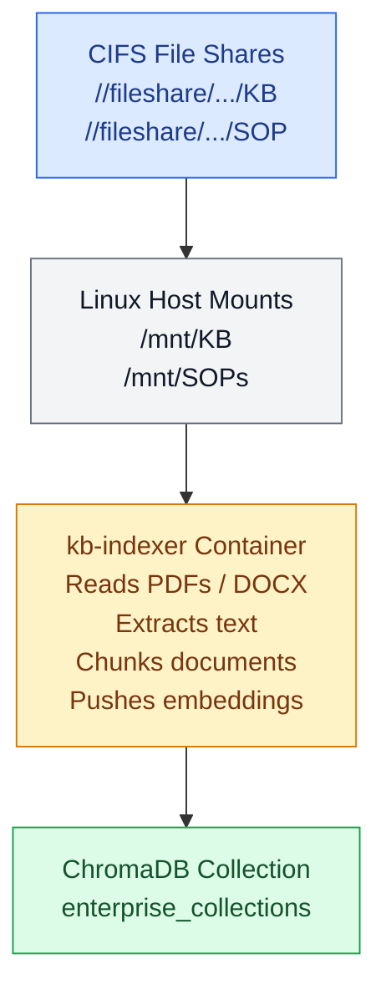

## Architecture Overview

The AI-POC pipeline retrieves relevant internal content and augments the LLM’s response using ChromaDB-stored KB/SOP embeddings.

---

## Data Ingestion & Indexing Workflow

Internal KB & SOP directories on the Windows file server are mounted into the Linux host and processed by the indexer container:

This ensures all documentation is searchable and query-ready.

---

## RAG Query Flow (Step-by-Step)

1. User asks a question in OpenWebUI.

2. OpenWebUI’s RAG tool sends the question → RAG API.

3. RAG API queries ChromaDB (collection: enterprise_collections) to retrieve the top-K relevant chunks.

4. RAG API inserts those chunks into a structured prompt.

5. RAG API sends the prompt to Ollama, which performs LLM inference on-prem.

6. The LLM generates the final answer with context and citations.

7. OpenWebUI displays the answer to the user.

All retrieval and inference operations occur internally.

---

## Core Components

1. OpenWebUI

    * Main chat interface for IT and researchers

    * Supports RAG tool integration

    * Hosted locally and isolated from external networks

2. RAG API

    * Python/FastAPI microservice
    * Handles:
        * retrieval -> propmpt building -> LLM inference
        * formatting prompt templates
        * managing context windows

3. chromaDB
    * Vector database storing embeddings
    * Collection: enterprise_collections
    * Accessible only on internal Docker networks

4. Ollama
    * Local LLM runtime (GPU-enabled)
    * Supports models such as:
        * llama2:7b
        * pi4-reasoning:14b
    * Encsures data never leaves the internal environment

5. kb-indexer
    * Scans mounted KB/SOP directories
    * Converts PDF/DOCX -> text
    * Pushes to ChromaDB

---

# Security & Isolation

Fully on-prem; no external APIs

CIFS mounts set to read-only from Windows file server

Docker network isolation prevents cross-container exposure
